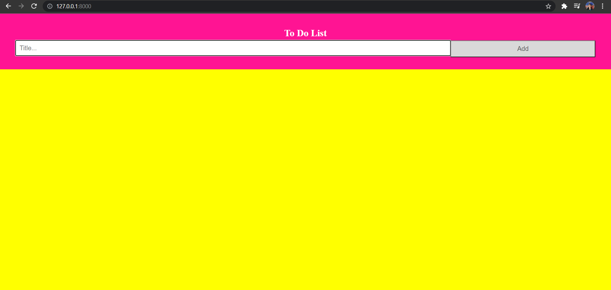

# Simple TodoList using Django

## ToDoList
I’ve GOT to remember that, you tell yourself.  You feel like you have a thousand things swimming around in your head and you feel like you are grasping at straws trying to remember everything even though you know they are doomed to slip away.  If this sounds familiar, you know the importance of a to-do list. As soon as you write down everything that’s scrambling around in your brain, you feel a sense of relief.

## Tech Used
* Python
* Django
* HTML
* CSS

## Screenshot

